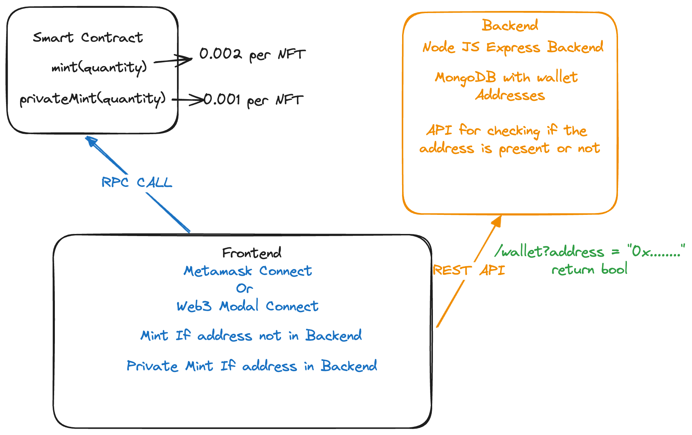

# Metaborong Simple NFT mint

This is task project to assess you Frontend, Backend and web3 skill.
In this you have to build Frontend and Backend that will provide a mint iterface for the users to mint NFT from the smart contract.


## Authors

- [@Soumojit28](https://www.github.com/Soumojit28)


## Smart Contract

- Here is the smart contract address: https://sepolia.etherscan.io/address/0xfb132d7fecfdc01771c6897f04b81f75a28737fb#code
- The smart contract have mint(uint256 amount) and privateMint(uint256 amount) for interaction.
- Price for mint = 0.002 ether 
- Price for privateMint = 0.001 ether


## Frontend
- The frontend should be built on react.js or next.js.
- Must have wallet connect functionality for web3 wallets like metamask.
- Should be a single page website for the wallet connection and one mint button.
- Should have loading icon, success and fail message.
- Should do api call to the backend to check if the wallet is present in db or not
## Backend API Reference
Backend should use Node JS , Express JS and MongoDB as Backend.

#### Check if the wallet address is present or not


```http
  GET /wallet?address={address}
```

| Parameter | Type     | Description                       |
| :-------- | :------- | :-------------------------------- |
| `address`      | `string` | **Required**. Wallet Address|

returns `bool`


## Diagram



